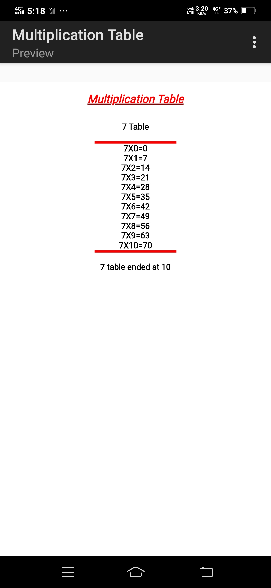

# 🧮 Multiplication Table Generator

A simple JavaScript project that prompts the user to enter a number and generates its multiplication table up to a specified limit. Built using plain HTML and JavaScript.

## 🚀 Features

- User-friendly prompts to collect input
- Validates user input to ensure only numbers are accepted
- Displays the multiplication table dynamically on the page
- Highlights the start and end of the table with styled separators.
  
## 🛠️ Technologies Used

- HTML
- JavaScript (Vanilla)
- CSS
  
## 📸 Preview 




## 📦 How to Run

1. Clone the repository:
   ```bash
   git clone https://github.com/shravanithouta108/Multiplication-Table.git

2. Navigate to the project directory:

cd Multiplication-Table


3. Open the index.html file in your browser.

You can also double-click the file or drag it into a browser window.

## ✏️ Code Overview

The script:

- Prompts the user for a base number (n) and an end number (m)

- Repeats prompts if input is invalid

- Dynamically writes the multiplication table using document.write()


## 🧪 Sample Input/Output

Enter which table you want: 7 <br>
Enter till which number you want to end the table: 10

Output:

7 × 0 = 0
7 × 1 = 7
...
7 × 10 = 70

## ⚠️ Note

Using document.write() can overwrite the entire page if used after the DOM is fully loaded. This project is kept simple for learning purposes.

## 📄 License

This project is open source and available under the MIT License.
